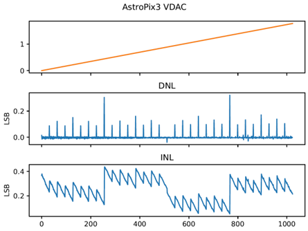

# DAC

## Current DAC

Bias currents are generated by integrated 6 bit current DACs.
The reference current is $\approx 3 \mu$A, the output current is set by the DACVAL (0-63) and the individual current divider:
$$
I_{bias} = 3 \mu \text{A} \dfrac{\text{DACVAL}}{63} \text{DIVIDER}
$$

## Voltage DAC

{width=100%}
/// caption
DNL and INL of integrated 10b R2R voltage dac
///

AstroPix features integrated 10 bit R2R Voltage DACs to internally generate the comparator threshold (Vth) and baseline(Bl), the cascode voltage (Vcasc2).

The reference voltage is vdda!, therefore the output voltage is set by the DACVAL (0-1023):
$$
V_{out} = V(\text{vdda!}) \dfrac{\text{DACVAL}}{1023}
$$
If the external voltage card is used, the voltages will be forced to the values set by the external voltagecard.
