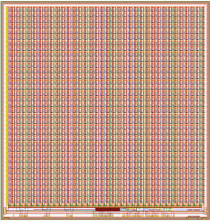

# AstroPix3 Specifications
Submission Status: Submitted June 2022

{width="300" align=right}
/// caption
AstroPix3 Layout
///

## Summary
### SOA
- Max. Junction temperature: +150°C
- Temperature requirement for AMEGO-X: -10°C to +40°C +/-5°

### Supplies
- Analog Supply VDDA: 1.8V
- Analog Supply VSSA: 1.2V
- Digital Supply VDDD: 1.8V
- Analog Ground GNDA
- Digital Ground GNDD
- Sensor Reverse Bias Voltage: 0 to -400V with respect to GNDA
- External Bias/Threshold voltages: 4 * (0-1.8V configurable)

### Pixel Matrix
- 500u Pixel Pitch and 300u Pixel Size
- 35 x 35 pixels
- first 3 cols PMOS amplifier others NMOS
- Pixel Dynamic Range 20 keV - 250 keV
- Noise Floor 5keV (2%@662keV)
- Pixel Comparator Outputs Row/Column OR wired

### Matrix Digitisation
- Time over Threshold (ToT) counter 12 bit @ 200Mhz (1% @ 700keV) for each column/row (Pixels wired OR in row/column)
- Time of Arrival timestamp counter 8 bit @ 2Mhz

### Power dissipation

### Digital Interface
- TS Clock: 2Mhz with half period max. delay over ~20 Chip row
- LVDS Clock: Independently running in each chip Incoherent
- At the moment no PLL on chip for that clock, dispatched from FE chip to chip
- Common Interrupt for row wake-up
- Common Hold for data discarding
- Unique ID for each APS
- 5 QSPI I/O: Quad  SPI in Daisy Chain
- CLK 20 Mhz : Chip to Chip
- MOSI: Chip to Chip (Left to right in the chain)
- MISO[1:0] : Chip to Chip (right to left in the chain)
- CS (Chips Select): right to left to synchronize Chip output and input stages

### Auxiliary Sensors
- 4 unbuffered temperature sensors
