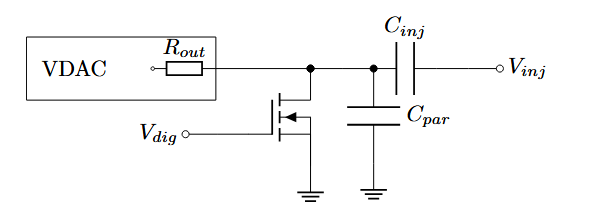

The injection can be controlled by:

* **external voltage card** generating the required injection pulses, in this case the digital injection (DigInj) input should be held at 0V
* **digital injection** to generate the pulses and the amplitude is set by the VDAC, in this case the injection pin (Inj)should float and the injection card should not be disconnected

The simplified injection circuit shown below uses a [voltage DAC](dac.md#voltage-dac) and an NFET transistor controlled by a digital pulse.

{width=100%}
/// caption
Injection circuit, showing analog and digital injection input
///

At the rising edge of the digital pulse, the left node of the injection capacitance $C_{\text{inj}}$ located in every pixel is quickly pulled to ground and the parasitic capacitance $C_\text{par}$ is discharged. This causes a charge $Q_{\text{inj}}$ being injected into the pixel n-well, if the according injection bits for row and column are enabled in the [column configuration](configuration.md#column-config). The charge can be calculated by dividing the injection amplitude by the value of the injection capacitance, which has a value of around 7fF:
$$
Q_{\text{inj}}= \dfrac{\Delta V_{\text{inj}}}{C_{\text{inj}}} = \dfrac{\Delta V_{\text{inj}}}{7\text{fF}}
$$

The trailing edge of the injection pulse should be slow, this is ensured by the high output impedance of the voltage DAC.

