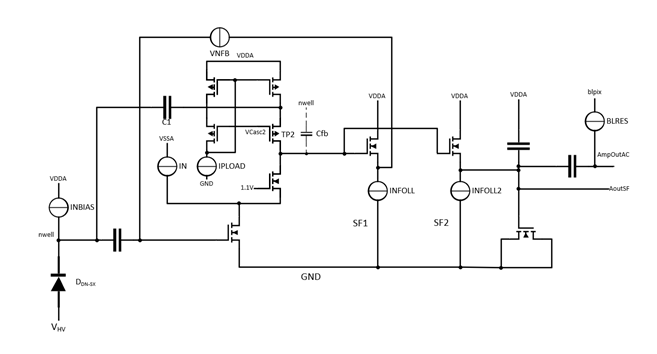
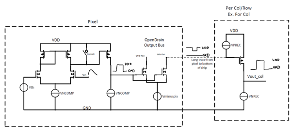

# Pixel Electronics
## CSA and bandpass filter
A simplified schematic of the pixel electronics is shown below:

{width=100%}
/// caption
Reverse biased sensor diode formed deep n-well and p-substrate, cascoded charge sensitive amplifier (CSA) and bandpass filter
///

The sensing element is the pn-diode formed by the p-substrate and the deep n-well of the pixel. By applying a high reverse bias, a thick depletion region is created. Electrons generated by charged particles or photons in the depletion region are quickly transported to the collection n-well by drift, due to the strong electric field.  
A charge sensitive amplifier (CSA) is capacitively coupled to the collection n-well, it is implemented as a cascode amplifier with a cascode load and an NFET input device. The feedback capacitance of around 500 aF is formed by the parasitic drain junction capacitance of the load cascode PFET. A voltage signal is produced dependent on the input charge and this capacitance. Assuming that the amplifier has a high open loop gain $A_{0}$ with $A_{O} C_{fb} >> C_{det}$ this can be simplified to:
$$
v_{out} \approx \dfrac{Q}{C_{fb}}
$$
A second, much larger 15 fF feedback capacitance C1 is connected from the amplifier input to the voltage node between the load transistors. If the cascode transistor is in saturation, the impedance from the output to this node is high, but if there is a large input signal, the cascoded transistor goes into the linear region and there is a low impedance path from the output to this node. Therefore, for a large input signal the two capacitors appear to be in parallel resulting in a reduced closed-loop gain of:
$$
v_{out} \approx \dfrac{Q}{C_{fb}+C_{fb2}}
$$
The feedback capacitance is continuously discharged by a constant current source VNFB, which results in a linear decay of the output pulse.
The amplifiers input DC operating point is set by the source-follower SF1. The second source-follower SF2 acts as a low pass filter. Due to its non-linearity, the rising edge has a fast rise time, but the falling edge because the load current source INFOLL2 is biased with a low current. A higher current increases the low pass filter bandwidth, resulting in a steeper slope i.e. shorter time-over-threshold (ToT) but also higher noise. From the output of SF2 the signal is capacitively coupled through a Metal-Insulator-Metal capacitor to AmpOutAC. The DC level is set by the voltage DAC blpix, which is connected to the signal though a small current source, acting as a high pass filter together with the coupling capacitance.

## Comparator and Levelshifter
The signal path from the comparator input to the receiver output is shown below:
{width=100%}
/// caption
CMOS comparator and Levelshifter
///
The comparator is a two stage amplifier with the first stage being a NFET differential amplifier with a PFET current source load and the second stage being a common-source amplifier to increase the gain.  
The analog voltage pulse goes into the comparator and gets compared to the threshold voltage Vth. The comparator bias current is set by the current digital-to-analog converter (DAC) VNCOMP. The output is a positive voltage pulse with Vlow 0V and VHigh 1.8V.
Due to mismatch, the differential amplifier in the comparator is not totally symmetric. This results in a shift of the effective threshold to the value set by Vth. A compensation mechanism is implemented in AstroPix4. It consists of a 3bit current DAC which can be tuned to make the tail currents in the differential stage equal.  
The following stage is an open drain NFET, pulled up by the current source VPREC. This NFET converts the positive pulse to a negative pulse. The source of the NFET is connected to Vminuspix (normally 0.7 - 1V), which reduces the signal amplitude from 1.8V to 0.8 - 1.1V. A higher signal amplitude, i.e. a lower value of vminuspix reduces the propagation delay but also increases EMI at the same time.  
In the hit buffer of every pixel, the signal is converted back to the full amplitude by a PFET common-source amplifier. The output signal is a positive pulse with a fast rise time and a fall time which is determined by the discharge current VNREC.