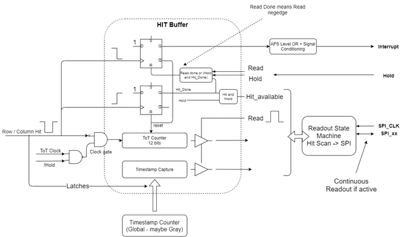

# AstroPix3 Hit Buffer

{width=100%}
/// caption
Hitbuffer showing ToA and ToT capturing, reset after read and hold masking
///

The above circuit is implemented for every row and column. An incoming active low hit signal enables the clockgate of the ToT counter, starting the ToT measurement and latching the ToA timestamp.
At the same time, the negative edge flipflop on top is triggered, activating the interrupt and deactivating the clock gate of the ToT counter. At the trailing edge of the hit pulse, a positive edge flipflop is triggered, signalizing to the readout state machine, that there is a hit available for readout. If hold is active this hit flag is masked. 

As soon as the SPI clock is toggled by the DAQ, the readout state machine starts to transfer the hits from the hit buffer to the SPI Interface. When this process is completed, the flipflops are reset and ready for the next hit.
