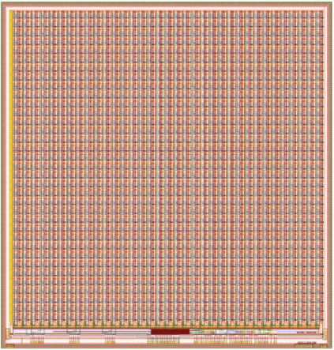

# AstroPix5 Specifications
Submission Status: Submitted December 2025

<!-- {width="300" align=right}
/// caption
AstroPix3 Layout
/// -->

## Summary
### Operating Temperature
- Temperature requirement for AMEGO-X: -10 °C to +40 °C +/-5°

### Supplies
- Analog Supply VDDA: 1.8 V
- Analog Supply VSSA: 1.2 V
- Analog Supply VMINUS: 0.7 V (generated internally)
- Digital Supply VDDD: 1.8 V
- Digital Supply VGATE: 2.1 V (generated internally)
- Analog Ground GNDA
- Digital Ground GNDD
- Sensor Reverse Bias Voltage: 0 to -400 V with respect to GNDA
- External Bias/Threshold voltages: 4 * (0-1.8 V configurable)

### Pixel Matrix
- 500u Pixel Pitch and 300u Pixel Size
- 36 x 34 pixels
- First 2 columns feature dynamic feedback pixels
- Third column features NMOS comparator with resistive load
- Fourth column features NMOS comparator with PMOS load
- Pixel Dynamic Range 20 keV - 700 keV
- Noise Floor 5keV (2%@662keV)

### Matrix Digitisation
- Per pixel hitbuffer to store 17 bit ToA and 16 bit ToT together with 6bit TDC timestamp

### Power dissipation

### Digital Interface
- Reference Clock: 2.5Mhz for internal PLL
- LVDS Clock: 20 MHz Independently running in each chip Incoherent
- Common Interrupt for row wake-up
- Common Hold for data discarding
- Unique ID for each APS
- 5 SPI I/O: Dual MISO SPI in Daisy Chain
- Left side SPI also available differentially
- CLK 20 Mhz : Chip to Chip
- MOSI: Chip to Chip (Left to right in the chain)
- MISO[1:0] : Chip to Chip (right to left in the chain)
- CS (Chips Select): right to left to synchronize Chip output and input stages

### Auxiliary Sensors
- 2 temperature sensors connected to external pads which also can be read out via the integrated ADC
