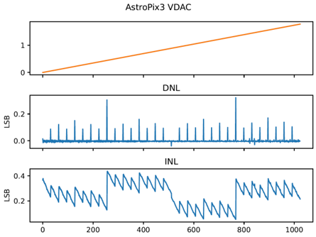

# Voltage DAC

{width=100%}
/// caption
Integrated 10b voltage dac
///

AstroPix features integrated R2R Voltage DACs to internally generate the comparator threshold (Vth) and baseline(Bl), the cascode voltage (Vcasc2) and the low level for the pixel sender-receiver circuit(Vminus).

The reference voltage is vdda!, therefore the output voltage is set by:
$$
V_{out} = V(\text{vdda!}) \dfrac{\text{dacval}}{1023}
$$
If the external voltage card is used, the voltages will be forced to the values set by the voltagecard.
